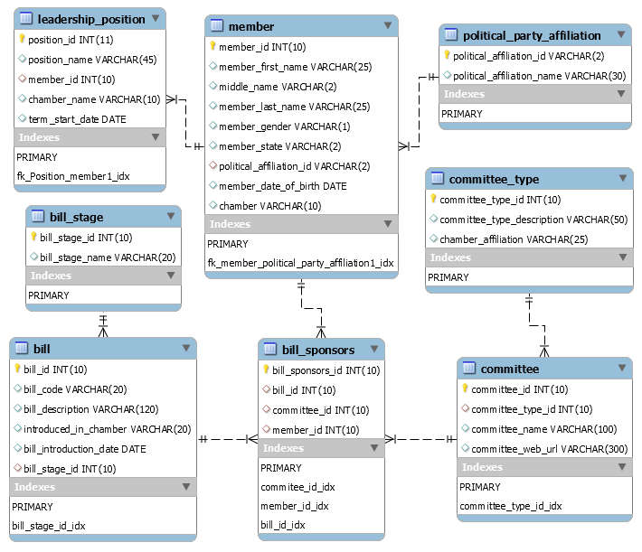

# Final Project Documentation
## Motivation  
The database we have chosen to build for this group project contains data about the United States Congress. We chose this topic because we found it not just interesting to work on, but also useful and informative. This kind of database could serve as a convenient tool for  regular citizens to find out more about their congressional representatives and their activities. It could also encourage citizens’ engagement in the political process.
 
We believe that this database would be an excellent resource of “history” regarding current representatives in the U.S. Congress. Also, we believe that this database is useful for any citizen who is interested in political issues and wants to find out more about the legislative branch of government and who is his/her state representatives in each chamber. Besides, with the current state of our government, we thought that this would be a useful resource for citizens to gather more information from their current congressman/representative. This way they would know whom to contact when they need to file for benefits such as unemployment, grants, stimulus checks, and other financial support coming from the government at the federal/state level.

## Database Description 
Even though the structure of our database would permit the inclusion of all current congressional members and all legislative bills being introduced in either of the two congressional chambers (Senate and House of Representatives), due to the scope of the complete data, we currently included only data regarding congressional members from Maryland and three surrounding states (Virginia, Delaware, and Pennsylvania) as well as few additional representatives. They are not from these states but are holding a leadership position in either of the two congressional chambers. Furthermore, our dataset on bills is only limited to a few sample bills.
The structure of the database consists of eight tables: member, leadership position, political party affiliation, committee, committee type, bill, bill stage, and bill sponsors.

For each member in each chamber, we incorporate attributes such as their political party, state, leadership position, associated committees, bill, and personal information. Additionally, we plan to include the most recent congressional session since it has a more significant impact on current issues/policies.  

## Logical Design
Our work on ERD for this database concept was initiated with the creation of the tentative database model. Using Microsoft Excel, we worked and analyzed any potential entities that would require the creation of a table, which then would become a part of this database. In that stage of our creative endeavor, we also included sample records to bring clarity to what data types were most appropriate for each column in all the tables that we designed. With some trial and error, we were able to achieve a tentative bird’s eye view model that became a roadmap for actual work on ERD conducted in Workbench. The following represents conceptual work done in Excel and which became a stepping stone towards our tentative ERD setup.

## Changes from Intial Design
Since our initial proposal, we have made many tweaks to our project from what we originally have. We have listed some changes that we have made since our very first project submission below:
- Eliminating tables
    * We have reevaluated our plan for the possible tables to be incorporated in the database. We decided to eliminate irrelevant tables, such as the original lobbyist table. 
- Adding more columns in the database
    * We added a column called “middle_name” for the middle name of the representatives of congress. 
    * We also added the column for “chamber,”and we considered putting this in the “member” table of the database.
- Initially the scope of this database was to include about 5 of the congressional sessions that took place within 20 years. Our group now sees problems with this since there is too much data. 
    * Instead, the data pertaining to members in our database focused only with data concerning Maryland and the states that border it; Virginia, Delaware, and Pennsylvania. Data that includes leadership house, leadership senate, state, and the committee included all recent data for our database. Since there is a fixed amount of data for these tables, and there is a minimal amount of data for it, it was easy to include all the data for these specific tables. 
- As far as our group dynamic, we have changed our means of communication to accommodate current health conditions and procedures. 
    * We have changed our group meet time to Friday mornings at 11:30 via Zoom meetings with the use of GroupMe as well.
    * We have done so in attempts to support group member’s schedules as we are not all in the same time zone.

## Troubleshooting
Throughout the process of working on our final projects, there are many times when we got stuck on creating the database, using SQL, technical issues, and other issues that we faced and solved through.
 
- **Column issue:** When we import the data, the birthdates of the representatives are not written in the correct format (YYYY-MM-DD).
  * **Resolved:** We first thought that we could fix this in 2 ways. The first way we thought was to go back and correct all the birthdates. The second way we thought is making the birthdate into a string variable rather than  a data variable.  In the end, we figured out that when we add the column names into the CSV file, SQL reads them and tries to add them to the table as well. So to fix this, we just deleted the very first row.
- **Communication issue:** Due to COVID-19, we moved to online learning. By moving to online learning, it makes the weekly face to face meeting that we have very difficult. Besides, many of us are in different time zones. 
  * **Resolved:** In order to accommodate the COVID-19 regulations, only source of communication is online. We set aside our personal time to make this project happen. We use Zoom meetings, text messages, and phone calls to communicate our wants/needs regarding the project. Throughout the process, we learned how important it is to communicate with our group members during this pandemic. 

## Future Advancement
- [ ] Add past and future congressional/representatives. 
- [ ] Expand from the 4 states that we are doing to all 50 states in the United States. This allows more people from other states to interact with the database.
- [ ] We can also use the information here to code it into a website. By doing this, it creates a more appealing visual form of the database.
